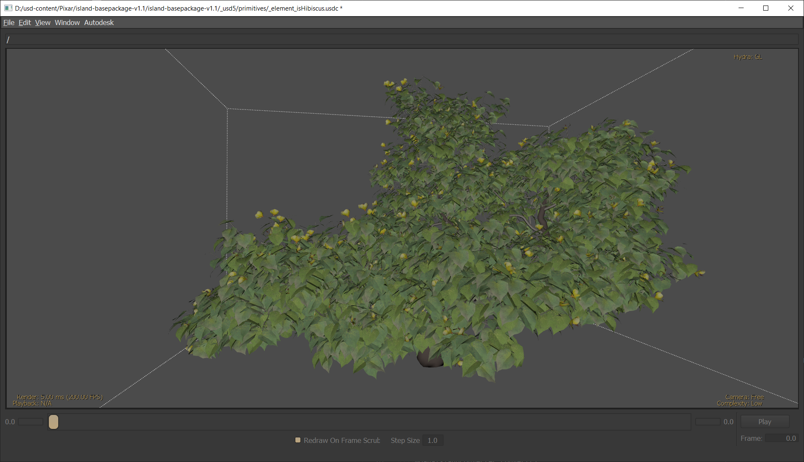
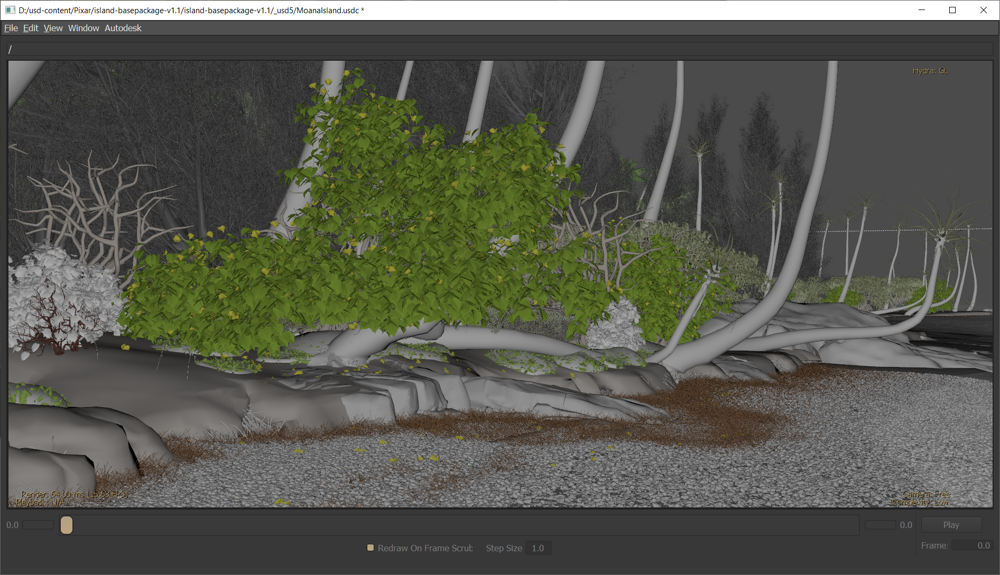

# Converting Disney's Moana Island Scene to USD

## Motivation

As of early 2020, accessing large, production-level USD content can be a challenge outside of studios. Attempting to stress-test DCC tools and studying USD workflows for large scenes can thus be a challenge: the tools that work well for the proverbial [Kitchen Set](http://graphics.pixar.com/usd/downloads.html) might not work as well for content structured in a different hierarchy.

Disney's [Moana Island Scene](https://www.technology.disneyanimation.com/islandscene) being a close relative to the Kitchen Set, using it as a source of high-quality content.

## Screenshots

_Hibiscus asset, with Ptex textures:_


_View from the beach scene, without Ptex textures:_


## Limitations

Given the narrow use case, only some content is currently translated to USD. Some of the limitations include:
 * No animations
 * No curves
 * Not a 1:1 mapping of the original scene hierarchy
 * Limited shader graph setup (especially with regards to displacement maps)
 * Textures are not copied from the source directory to the destination directory. This is only due to storage and time constraints.
 * Requires a build of `usdview` with Ptex enabled to view textures.
 * Python scripts use `Sdf` APIs instead of the much friendlier `Usd` APIs in order to efficiently batch-create Prims.

Feel free to contribute a Pull Request if you see a bug or an improvement opportunity!

## Running the script

Except for the USD Python bindings, the script only relies on `tqdm` to print progress bars to the console during the conversion. Some assets can take a while to process.

From a terminal:
```
pip install -r requirements.txt
python -m moana2usd --source-dir SOURCE_DIR --dest-dir DEST_DIR
```
where:
 * `SOURCE_DIR` is the location where the Moana Island Scene can be found.
 * `DEST_DIR` is the location where the converted USD files will be written.

For the full usage options:
```console
user@machine:~$ python -m moana2usd --help
usage: __main__.py [-h] [--source-dir SOURCE_DIR] [--dest-dir DEST_DIR]
                   [--format {sdf,usd,usda,usdc,usdz}] [--load-textures]
                   [--omit-small-instances]

Convert the Moana Island scene to USD.

optional arguments:
  -h, --help            show this help message and exit
  --source-dir SOURCE_DIR
                        Directory where the Moana Island scene is located.
  --dest-dir DEST_DIR   Output directory where the USD data will be written.
  --format {sdf,usd,usda,usdc,usdz}
                        File format to output data to.
  --load-textures       Create USD assets with Ptex textures.
  --omit-small-instances
                        Omit instantiation of small (or numerous) instances.
```

## Running the tests

A (limited) set of tests are included in the project. To execute them, run the following command from a terminal:
```
python -m unittest discover
```
